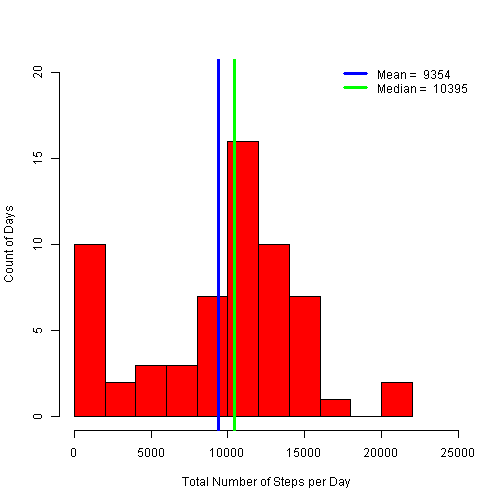
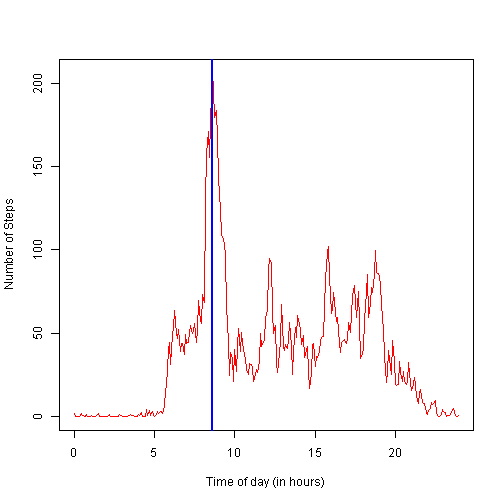
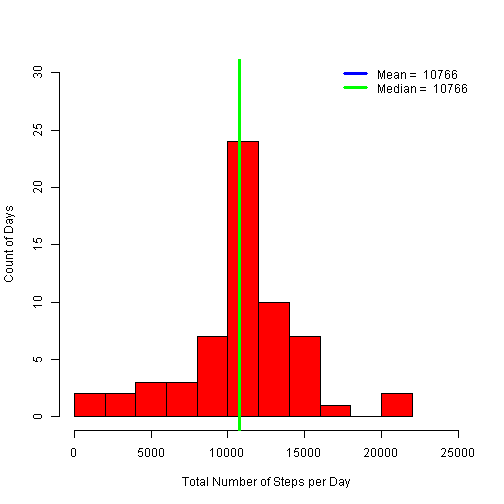
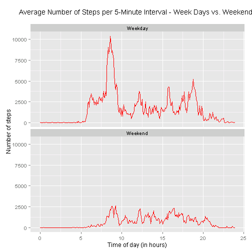

## Loading and preprocessing the data
Read in the file, and do two pre-processing tasks  

* convert the formatted 5 minute intervals to numeric elapsed time (in hours)  
* determine weekday/weekend for each date

```r
library(dplyr);library(ggplot2)
unzip("activity.zip")
dat <- read.csv("activity.csv")
dat <- dat %>% 
  mutate( hour = trunc(interval/100)) %>%
  mutate( min  = interval-hour*100) %>%
  mutate( time = min/60 + hour) %>%
  mutate( day = weekdays(as.Date(date), abbreviate=TRUE)) %>%
  mutate( wday = ifelse( day %in% c("Sat","Sun"), "Weekend", "Weekday") )
```


## What is mean total number of steps taken per day?
Calculate the total number of steps each day, and the mean and median number of steps per day over the whole time period.  
Per instructions, ignore the missing values at this stage. This causes the total steps for 8 days to be set to 0, since all the values for those days are NA. (Demonstrated in missing values section below). While this is not the best approach to handling the missing values, it does illustrate the results of imputing missing values later.

```r
daysum <- dat %>% group_by (date) %>% summarize(steps=sum(steps,na.rm = TRUE))
mn <- round(mean(daysum$steps))
md <- round(median(daysum$steps))
```
Plot a histogram of the total number of steps taken each day

```r
with(daysum, hist(steps, breaks=10, col="red", xlim = c(0,25000), ylim=c(0,20),
                  main="", xlab="Total Number of Steps per Day", ylab="Count of Days") )
abline(v=mn, col="blue", lwd=3)
abline(v=md, col="green", lwd=3)
legend("topright", lty = 1 , lwd=3, bty = "n", col = c("blue", "green"),
           legend = c(    paste("Mean = ",as.character(mn)), 
                          paste("Median = ",as.character(md))) )
```

 

## What is the average daily activity pattern?
Calculate the mean number of steps taken during each 5 minute time interval. (Once again, the missing values are ignored.) Also determine which interval, on average, contains the maximum number of steps.

```r
intsum <- dat %>% group_by (interval, time) %>% summarize(steps2=mean(steps,na.rm = TRUE))
intmax <- intsum[which.max(intsum$steps2),]
paste("Maximum steps per interval = ",round(intmax$steps2),"at interval ",intmax$interval)
```

```
## [1] "Maximum steps per interval =  206 at interval  835"
```

Create  time series plot which shows the average number of steps in each 5-minute time interval.

```r
with(intsum, plot( time, steps2, type="l", col="red",
     xlab="Time of day (in hours)", ylab="Number of Steps") )
abline(v=intmax$time, col="blue", lwd=2)
```

 

## Imputing missing values


```r
tmp <- dat %>% filter( is.na(steps)) %>% mutate( date = factor(date))
paste("There are ",length(tmp$date),"missing values")
```

```
## [1] "There are  2304 missing values"
```

```r
table(substr(tmp$date,6,10))
```

```
## 
## 10-01 10-08 11-01 11-04 11-09 11-10 11-14 11-30 
##   288   288   288   288   288   288   288   288
```
Note that the mssing values represent complete days of  data. In my opinion it would be be preferable to drop these days from the data set completely, since they contribute nothing. However, the assignment requires imptuing values for this missing data, so I have populated them with appropriate 5-minute averages, as calculated in the previous section.

```r
dat1 <- dat %>% inner_join( intsum[,c("interval","steps2")], by="interval") %>%
  mutate( steps = ifelse( is.na(steps), steps2, steps))
```
Calculate the revised total number of steps each day, and the mean and median number of steps per day over the whole time period. (All using the new dataset)

```r
daysum1 <- dat1 %>% group_by (date) %>% summarize(steps=sum(steps))
mn <- round(mean(daysum1$steps))
md <- round(median(daysum1$steps))
```

Plot the same histogram as above, using the new dataset, and compare the results

```r
with(daysum1, hist(steps, breaks=10, col="red", xlim = c(0,25000), ylim=c(0,30),
                  main="", xlab="Total Number of Steps per Day", ylab="Count of Days") )
abline(v=mn, col="blue", lwd=3)
abline(v=md, col="green", lwd=3)
legend("topright", lty = 1 , lwd=3, bty = "n", col = c("blue", "green"),
           legend = c(    paste("Mean = ",as.character(mn)), 
                          paste("Median = ",as.character(md))) )
```

 

Comparing the results before and after imputing the missing values

* The histogram has changed because the eight days which had no values have moved from zero to the bar which begins at 1000
* The mean has moved significantly. This is because the eight days are now contributing steps to the numerator, as well as being counted in the denominator.
* The median has moved a little, but not as much as the mean (because it was less affected by the zero days on the first plot)


## Are there differences in activity patterns between weekdays and weekends?
Note that a factor variable ("wday") with values ("Weekday" and "Weekend") was already added to the dataset in the pre-processing step above, and carried forward into the dataset where the missing values were filled in (dat1). The filled-in data set is used in this section.

Calculate the mean number of steps taken during each 5-minute interval, averaged across weekday days and weekend days (two separate series in one data frame)

```r
wdsum <- dat1 %>% group_by (wday,time) %>% summarize(steps=sum(steps))
```

Create a panel plot containing the two separate time series plots.

```r
g <- ggplot( wdsum, aes(time,steps)) + 
  geom_line(colour="red") +
  facet_wrap(~ wday, scales = "fixed", nrow=2) +
  labs( x = "Time of day (in hours)", y = "Number of steps") +
  ggtitle("Average Number of Steps per 5-Minute Interval - Week Days vs. Weekends\n") +
  theme(title = element_text(size = 12))
g
```

 

